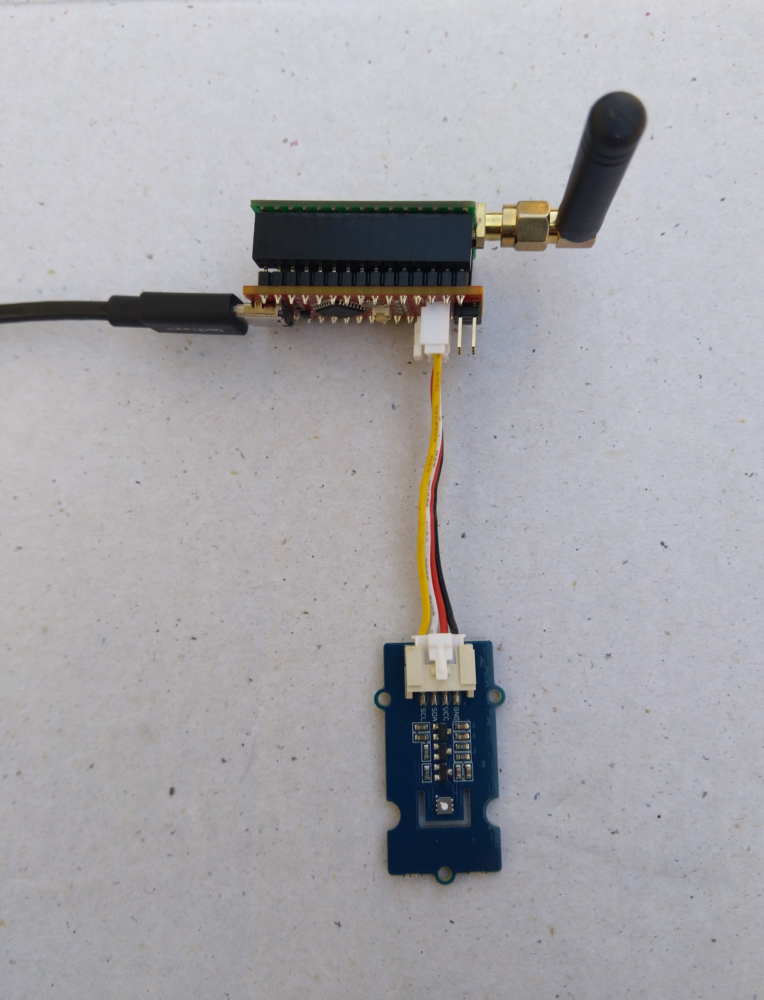

# FieldGateway.LoRa.SeeeduinoNanoEasySensorsClientVOCeCO2
[Arduino Nano](https://www.arduino.cc/en/Guide/ArduinoNano), EasySensors RFM95 shield, VOC and eCO2 monitor sensor node for my Windows 10 IoT Core [LoRa](https://lora-alliance.org/) field gateways

I used the [Arduino-Lora](https://github.com/sandeepmistry/arduino-LoRa), [Sparkfun ATSHA204](https://github.com/sparkfun/SparkFun_ATSHA204_Arduino_Library) and [Sparkfun SGP30 library](https://www.sparkfun.com/products/14813) libraries, thank you to the authors Sandeep Mistry & Sparkfun.

My Arduino Nano clients uses
* [Arduino Nano radio shield RFM95](https://www.tindie.com/products/easySensors/arduino-nano-radio-shield-rfm6995-or-nrf24l01/) 
* [Grove - VOC & eCO2(SGP30)](http://wiki.seeedstudio.com/Grove-VOC_and_eCO2_Gas_Sensor-SGP30/)
* [Seeeduino nano](https://www.seeedstudio.com/Seeeduino-Nano-p-4111.html)

Detailed blog [post](https://blog.devmobile.co.nz/2019/08/31/grove-voc-and-eco2-gas-sensor-sgp30/)
